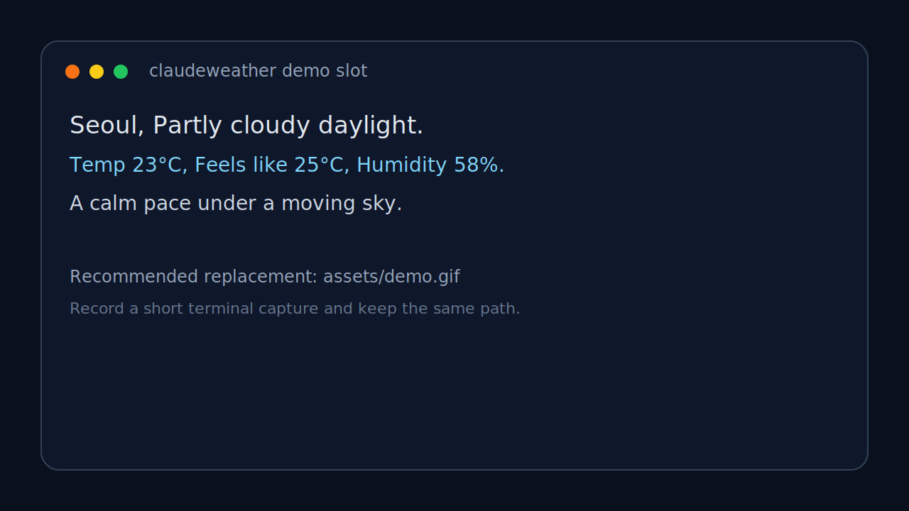

[English](./README.md) | [简体中文](./README-zh-CN.md) | [繁體中文](./README-zh-TW.md) | [日本語](./README-ja.md) | [한국어](./README-ko.md) | [Français](./README-fr.md) | [Русский](./README-ru.md) | [Español](./README-es.md) | [العربية](./README-ar.md)

# claudeweather

L'entrée de la documentation en français est prête.

La documentation complète suit actuellement la version anglaise :
[README.md](./README.md)
